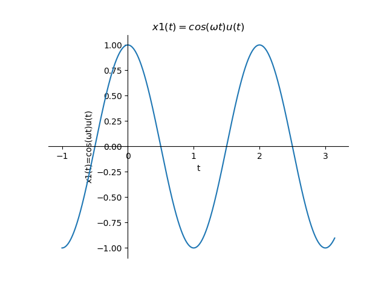

```
import matplotlib.pyplot as plt
import numpy as np
x0=-1
x1=np.pi
ω=np.pi
t0=1
#ω=π x1(t)=sin(ωt)u(t)
x=np.linspace(x0,x1,1000)
k=np.linspace(x0,x1,1000)
y=np.cos(ω*x)
plt.figure('函数图像')
plt.title("$x1(t)=cos(ωt)u(t)$")
plt.plot(x,y)
plt.xlabel('t')
plt.ylabel('x1(t)=cos(ωt)u(t)')
# gca ='get current axis'
ax = plt.gca()


ax.spines['right'].set_color('none')
ax.spines['top'].set_color('none')
ax.xaxis.set_ticks_position('bottom')
ax.yaxis.set_ticks_position('left')
ax.spines['bottom'].set_position(('data',0))
ax.spines['left'].set_position(('data',0))
plt.show()
```

